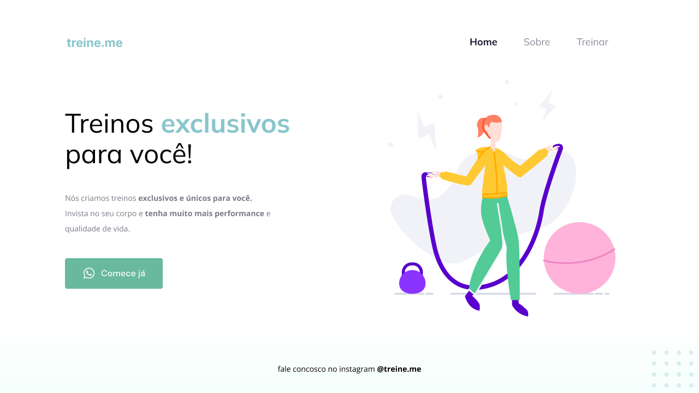

# Desafio 03 - Semântica e acessibilidade

## Sobre o desafio
O desafia proposto no curso Explorer da [Rocketseat](https://www.rocketseat.com.br/) referente aos ensinamentos do Stage 02. Onde recebemos o código sem a devida semântica e acebilidade para aplicar os conceitos corretamente.